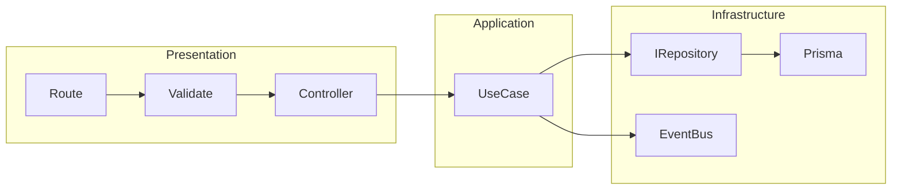

# Architecture

This document describes the high-level architecture of TaskFlow: layers, dependency rule, and how a request flows through the system. See the root [README.md](../README.md) "Architecture Overview" for a quick table; here we expand with actual package names and folder structure.

## Layers

The backend adheres to Clean Architecture's concentric layers, ensuring the domain remains pristine and testable.

| Layer              | Location                                                                 | Responsibility                                                           |
| :----------------- | :----------------------------------------------------------------------- | :----------------------------------------------------------------------- |
| **Presentation**   | `apps/api`: routes, controllers, middlewares                             | HTTP in/out, validation at the edge, no business logic                   |
| **Application**    | `packages/core`: use cases, subscribers                                  | Orchestrate repositories and events; one use case per action             |
| **Domain**         | `packages/shared`: entities, types; `packages/infra`: interfaces (ports) | Entity shapes, list/sort types, repository and event publisher contracts |
| **Infrastructure** | `packages/infra`: repositories, Prisma, event bus, errors                | Implement persistence (Prisma), publish/subscribe, domain errors         |

**Presentation** (`apps/api`) handles HTTP concerns exclusively—routes mount endpoints, controllers orchestrate calls without leaking business rules (Single Responsibility Principle, SRP), and Zod-powered middlewares validate inputs at the boundary, preventing invalid states from propagating inward.

**Application** (`packages/core`) embodies use-case purity: each file encapsulates one action (e.g., `createUserUseCase`), composing repositories and events without direct infra knowledge (Dependency Inversion Principle, DIP).

**Domain** (`packages/shared` entities + `packages/infra` ports) defines immutable, value-object-shaped entities like `UserId` and repository interfaces (`IUserRepository`), enforcing contracts that outer layers implement (Interface Segregation Principle, ISP).

**Infrastructure** (`packages/infra`) grounds abstractions: Prisma adapters realize ports, event bus decouples publishers from subscribers (Open-Closed Principle, OCP for swapping RabbitMQ), and custom `DomainError` types centralize failure modes.

Flow: **Routes → validate (Zod) → Controllers → Use cases (`@repo/core`) → Repositories (via interfaces) → Prisma**. Use cases may also publish events; subscribers (in core) consume them via the event bus from infra.

## Request Path (High Level)



- **Presentation:** `apps/api/src/routes`, `apps/api/src/controllers`, `apps/api/src/infra/http/middlewares`.
- **Application:** `packages/core/src/use-cases`, `packages/core/src/subscribers`.
- **Domain:** `packages/shared/src/entities`, `packages/shared/src/types`; `packages/infra/src/interfaces`.
- **Infrastructure:** `packages/infra/src/repositories`, `packages/infra/src/database`, `packages/infra/src/event-bus`, `packages/infra/src/errors`.

A POST `/users` request hits routes → Zod middleware rejects invalids early → controller extracts DTO → `createUserUseCase` validates domain rules, persists via `IUserRepository`, publishes event → subscriber logs asynchronously. No layer knows the next's tech stack, enabling parallel evolution.

## Clean Code Practices

TaskFlow prioritizes readability and maintainability per Clean Architecture's "screaming architecture"—folders scream intent (e.g., `use-cases/user/create-user.ts` leaves no guesswork). Names evoke behavior: `publishActivityCreatedEvent` over `sendEvent`.

Small functions rule: use cases clock under 50 lines, focusing on orchestration; validation pipelines chain Zod schemas composably. Events use typed payloads (`ActivityCreatedEventPayload`), enabling type-safe subscribers decoupled via in-memory bus (extensible to distributed).

Error handling shines: infra maps Prisma errors to domain ones, bubbling intent ("UserNotFound") without stack traces leaking out—keeps logs clean, tests focused.

## SOLID in Action

| Principle                                 | Implementation Example                                      | Benefit                               |
| :---------------------------------------- | :---------------------------------------------------------- | :------------------------------------ |
| **SRP (Single Responsibility Principle)** | One use case per file/action; controllers only map HTTP.    | Easy unit tests, no god classes.      |
| **OCP (Open-Closed Principle)**           | Event bus interface; swap in-memory for RabbitMQ.           | Extend without modifying core.        |
| **LSP (Liskov Substitution Principle)**   | Repos implement typed interfaces; no surprises in subtypes. | Polymorphic swaps (e.g., mock repos). |
| **ISP (Interface Segregation Principle)** | Narrow ports like `IUserRepository` (no bloat).             | Clients depend only on needs.         |
| **DIP (Dependency Inversion Principle)**  | Core uses abstractions; infra depends on domain ports.      | Tech-agnostic business logic.         |

## Dependency Rule

Core's inward-pointing dependencies exemplify the Dependency Rule—no Prisma imports in use cases, just ports from `@repo/infra`. This inverts control: high-level policies (business actions) dictate abstractions, while infra details adapt to them.

Controllers wire the graph at runtime, keeping the domain portable across frameworks (DIP in action). Result? Swappable persistence or a microservice pivot without core rewrites.

## Package and Folder Structure (Backend)

```bash
apps/api/src/
  routes/           → Mount and protect routes; apply validate middleware
  controllers/      → Call use cases; map HTTP request/response
  infra/http/middlewares/  → validate (Zod), error handler, logging
  config/           → Keycloak, env, server, database

packages/core/src/
  use-cases/        → user, task, project, activity (Create, Update, Delete, GetById, GetOffset, GetCursor, etc.)
  subscribers/      → Register with event bus for logging / side effects

packages/infra/src/
  interfaces/       → IRepository, IUserRepository, ITaskRepository, IProjectRepository, IActivityRepository, IEventPublisher
  repositories/     → Prisma-backed implementations
  database/         → Prisma client, error mapper, decorators
  event-bus/        → In-memory publisher/subscriber (RabbitMQ-ready)
  errors/           → DomainError

packages/shared/src/
  dtos/             → Zod DTOs for API input (Create, Update, Params, Query, pagination)
  schemas/          → Reusable Zod building blocks (Id, UserSchema, etc.)
  entities/         → Domain-shaped types
  events/           → Event names and payload types
  types/            → Pagination, sort, error codes, API response
```

For a concrete walk-through of one request (e.g. create user), see [Data flow](data-flow.md).
