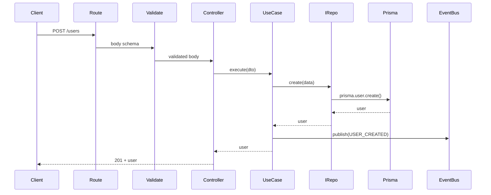

# Data flow

This document walks through the end-to-end path of a request: from HTTP through validation, use case, repository, and events. It clarifies where DTOs/schemas are used and where `DomainError` is thrown and handled.

## Example: Create user (command)

Flow for **POST /api/users/with-keycloak** (or a protected **POST /api/users** that creates a user):

1. **Route** — `api.routes.ts` mounts the handler. For signup: `POST /users/with-keycloak` with `validate({ body: CreateKeycloakUserDto })`.
2. **Validate** — Middleware runs Zod: `body` (and optionally `query`, `params`). On success, `req.body` is replaced with the parsed value; on failure, a `DomainError` with code `VALIDATION_FAILED` is passed to `next()` and the error middleware returns 400 + details.
3. **Controller** — e.g. `UserController.create()` or `createWithKeycloak()`. Receives validated body (typed as `TCreateUserDto` / `TCreateKeycloakUserDto`). Calls the use case: `this.createUserUC.execute(req.body)`.
4. **Use case** — `CreateUserUseCase.execute(input)`. Uses only interfaces: `IUserRepository`, `IEventPublisher`. It may throw `DomainError` (e.g. `EMAIL_IN_USE`, `USER_INACTIVE`). On success it calls `this.users.create(newUser)` then `this.events.publish(USER_CREATED, payload)`.
5. **Repository** — `UserRepository` (infra) implements `IUserRepository`. `create()` calls `prisma.user.create(...)` and returns the created user. Prisma errors are mapped to `DomainError` (e.g. unique → `EMAIL_IN_USE`, not found → `NOT_FOUND`) in the repository or via a decorator/mapper.
6. **Event bus** — Use case publishes `USER_CREATED`. Subscribers (e.g. in `packages/core/src/subscribers/userLogging.ts`) are registered with `eventBus` from infra; they run when the event is published (e.g. log to console).
7. **Response** — Use case returns the created user; controller sends `res.status(201).json(user)`. Any error thrown from the use case or repository is passed to `next(err)` and handled by the error middleware (e.g. `DomainError` → status + code + details).

## Example: Get user by ID (query)

Flow for **GET /api/users/:id** (protected):

1. **Route** — e.g. `GET /users/:id` with `validate({ params: UserParamsDto })`.
2. **Validate** — `params.id` must match the schema (e.g. UUID). Invalid params → `DomainError` → error middleware.
3. **Controller** — `UserController.getById(req, res, next)`. Reads `req.params.id`, calls `this.getUserByIdUC.execute(req.params.id)`.
4. **Use case** — `GetUserByIdUseCase.execute(id)`. Calls `this.users.findById(id)`. Returns `User | null`; controller may map null to 404 (or use case throws `DomainError` with `NOT_FOUND`).
5. **Repository** — `UserRepository.findById(id)` uses `prisma.user.findUnique()`. Maps Prisma errors to `DomainError` where applicable.
6. **Response** — Controller returns 200 + user or 404.

## Sequence diagram (create user)

## Where DTOs and schemas are used

- **Validation (edge):** The `validate` middleware uses Zod schemas (often the same as DTOs from `@repo/shared`). It validates `body`, `query`, and/or `params`. After validation, `req.body`/`req.query`/`req.params` hold the parsed values; TypeScript types (e.g. `TCreateUserDto`) describe these in controllers.
- **Use case input:** Use cases receive already-validated data. They typically accept DTO types (e.g. `TCreateUserDto`) or ids and params. They do not re-validate; validation is done once at the HTTP boundary.
- **Pagination/sort:** List endpoints use DTOs or shared types for offset/cursor params and sort (e.g. `TUserOffsetPagination`, `TUserCursorPagination`). Same idea: validate at route, pass typed params into use case.

## Where DomainError is thrown and handled

- **Validation middleware:** Invalid body/query/params → `DomainError({ code: "VALIDATION_FAILED", ... })` → `next(err)`.
- **Use cases:** Business rules (e.g. email already in use, user inactive) → `throw new DomainError({ code: "EMAIL_IN_USE", ... })`.
- **Repositories / Prisma layer:** Prisma errors are mapped to `DomainError` (e.g. P2002 → conflict, P2025 → not found) in `prisma-error-mapper.ts` or repository code; then thrown so the controller’s `catch` or Express error middleware can handle them.
- **Error middleware:** In `apps/api/src/infra/http/middlewares/error-handler.middleware.ts`. If `err` is `DomainError`, it responds with the appropriate status and body (code, message, details); otherwise it may send a generic 500.

This keeps a single, consistent error shape for the API and ensures that validation, business, and infrastructure failures all flow through the same handler.
